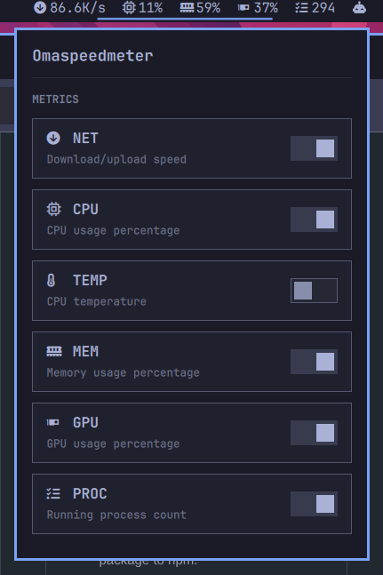

# [Omaspeedmeter](https://omarchyplugins.com/plugin.html?id=mt-shihab26.omaspeedmeter)

[](https://omarchy.org/manual/shell-plugins/)
[](https://github.com/mt-shihab26/omaspeedmeter/actions/workflows/validate.yml)
[](LICENSE)

[Omarchy](https://omarchy.org/) bar widget showing CPU, memory, network, temperature, GPU, and process count stats.

Click the widget in the bar to open a settings popup where you can toggle
metrics, split network into up/down segments, switch icons for word labels,
move the widget between bar sections, and change the refresh interval, GPU
vendor, temperature source, and network interface — all without editing
config files by hand.

<table>
<tr>
<td></td>
<td><video src="https://github.com/user-attachments/assets/0743feb3-6452-4608-bf96-f9ca24336373" width="100%" controls></video></td>
</tr>
</table>

## Installation

```bash
omarchy plugin add https://github.com/mt-shihab26/omaspeedmeter.git --enable
```

To remove it:

```bash
omarchy plugin remove mt-shihab26.omaspeedmeter
```

See the [Omarchy plugin manual](https://omarchy.org/manual/shell-plugins/) for
more on `omarchy plugin` commands.

## Metrics

| Metric  | Icon | Source                                                                                                                                              | Notes                                  |
| ------- | :--: | --------------------------------------------------------------------------------------------------------------------------------------------------- | -------------------------------------- |
| Network |      | [`/sys/class/net/<iface>/statistics/*_bytes`](https://docs.kernel.org/networking/statistics.html)                                                   | Combined or split into download/upload |
| CPU     |      | [`/proc/stat`](https://man7.org/linux/man-pages/man5/proc_stat.5.html)                                                                              | Usage % since the previous poll        |
| Temp    |      | [`/sys/class/thermal/thermal_zone*/temp`](https://docs.kernel.org/driver-api/thermal/sysfs-api.html)                                                | Prefers the CPU package/core sensor    |
| Memory  |      | [`/proc/meminfo`](https://man7.org/linux/man-pages/man5/proc_meminfo.5.html)                                                                        | `(MemTotal - MemAvailable) / MemTotal` |
| GPU     |  󰢮   | [`nvidia-smi`](https://docs.nvidia.com/deploy/nvidia-smi/index.html), sysfs, or [`intel_gpu_top`](https://man.archlinux.org/man/intel_gpu_top.1.en) | Vendor auto-detected                   |
| Procs   |      | [`/proc/[0-9]*`](https://man7.org/linux/man-pages/man5/proc.5.html)                                                                                 | Count of running process directories   |

Icons come from the [Nerd Font](https://www.nerdfonts.com/) glyph set Omarchy
already ships for the bar, so they render consistently with the built-in
widgets. Enable **word labels** in the settings popup to show `CPU`, `MEM`,
etc. instead.

CPU and network are rate-based and need two polls to produce a real number,
so they show `…` for the first tick after the widget loads or after the
refresh interval changes.

## Settings

All settings are toggled/edited from the bar widget's click popup, and are
persisted via [`omarchy bar set`](https://omarchy.org/manual/the-top-bar/).

| Setting     | Default | Description                                                                    |
| ----------- | ------- | ------------------------------------------------------------------------------ |
| `cpu`       | `true`  | Show CPU usage %                                                               |
| `mem`       | `true`  | Show memory usage %                                                            |
| `net`       | `true`  | Show network speed                                                             |
| `temp`      | `false` | Show CPU temperature                                                           |
| `gpu`       | `false` | Show GPU usage %                                                               |
| `procs`     | `false` | Show running process count                                                     |
| `labels`    | `false` | Show word labels (`CPU`, `MEM`, ...) instead of icons                          |
| `netSplit`  | `false` | Show download/upload as two separate segments                                  |
| `interval`  | `2`     | Refresh interval, in seconds                                                   |
| `gap`       | `17`    | Spacing between segments, in pixels (matches Omarchy's own bar widget spacing) |
| `gpuVendor` | `auto`  | `auto`, `nvidia`, `amd`, `intel`, or `none`                                    |
| `tempZone`  | `auto`  | `auto`, or a specific `/sys/class/thermal/thermal_zone*/temp` path             |
| `netIface`  | `auto`  | `auto`, or a specific network interface name                                   |

`auto` for GPU vendor and temperature zone probes the system on each poll;
pinning a specific value skips detection and avoids picking the wrong sensor
on machines with multiple thermal zones or GPUs. The network interface and
temperature zone dropdowns are populated live from
[`/sys/class/net`](https://docs.kernel.org/networking/statistics.html) and
[`/sys/class/thermal`](https://docs.kernel.org/driver-api/thermal/sysfs-api.html)
when the popup opens.

The bar position dropdown (left/center/right) reads and writes the widget's
placement via [`omarchy-shell`](https://omarchy.org/manual/omarchy-cli/)/
[`omarchy bar move`](https://omarchy.org/manual/the-top-bar/), independent of
the `defaultSection` set on first install.

## How it works

Each metric is collected by a small standalone bash script in [`bin/`](bin),
run on a timer by [`BarWidget.qml`](BarWidget.qml) and merged into a single
stats object:

- [`omaspeedmeter-cpu`](bin/omaspeedmeter-cpu) — reads
  [`/proc/stat`](https://man7.org/linux/man-pages/man5/proc_stat.5.html),
  diffs against a cached previous sample in
  [`$XDG_CACHE_HOME`](https://specifications.freedesktop.org/basedir-spec/basedir-spec-latest.html)`/omaspeedmeter/cpu`
  to compute usage %.
- [`omaspeedmeter-mem`](bin/omaspeedmeter-mem) — reads
  [`/proc/meminfo`](https://man7.org/linux/man-pages/man5/proc_meminfo.5.html)
  directly (no state needed).
- [`omaspeedmeter-net`](bin/omaspeedmeter-net) — reads interface byte
  counters from sysfs, diffs against `$XDG_CACHE_HOME/omaspeedmeter/net` to
  compute throughput.
- [`omaspeedmeter-temp`](bin/omaspeedmeter-temp) — reads a thermal zone from
  sysfs, auto-preferring a zone whose type matches a known CPU sensor
  (`coretemp`, `k10temp`, etc.).
- [`omaspeedmeter-gpu`](bin/omaspeedmeter-gpu) — detects the GPU vendor and
  shells out to [`nvidia-smi`](https://docs.nvidia.com/deploy/nvidia-smi/index.html),
  AMD's `gpu_busy_percent` sysfs file, or
  [`intel_gpu_top`](https://man.archlinux.org/man/intel_gpu_top.1.en).
- [`omaspeedmeter-procs`](bin/omaspeedmeter-procs) — counts
  [`/proc/[0-9]*`](https://man7.org/linux/man-pages/man5/proc.5.html)
  directories.

Each script only runs when its metric is enabled, and only prints a single
line of JSON (e.g. `{"cpu":42}`), which [`Model.js`](Model.js) parses and
formats into the bar segments. `Model.js` holds all the pure logic (settings
resolution, formatting, segment building) separately from the QML so it can
be reasoned about — and unit tested — without a
[Quickshell](https://quickshell.org/) runtime.

## Development

```bash
./link.sh
```

Symlinks `~/.config/omarchy/plugins/omaspeedmeter` to this repo, so Omarchy
loads the plugin straight from your working tree instead of a copy. Run
`./link.sh --remove` to remove the symlink.

```bash
omarchy restart shell
```

Restarts the [Omarchy shell](https://omarchy.org/manual/omarchy-cli/) to pick
up changes (`BarWidget.qml` is not hot-reloaded).

```bash
./format.sh
```

Formats the repo: [`qmlformat`](https://doc.qt.io/qt-6/qtqml-tooling-qmlformat.html)
for `BarWidget.qml`, [Prettier](https://prettier.io/) for Markdown/JSON/JS.
Run before committing.

## Requirements

- Linux with [`/proc`](https://man7.org/linux/man-pages/man5/proc.5.html) and
  [`/sys`](https://docs.kernel.org/filesystems/sysfs.html) available
  (standard on any distro).
- [`awk`](https://www.gnu.org/software/gawk/manual/gawk.html),
  [`bash`](https://www.gnu.org/software/bash/manual/bash.html),
  [`ip`](https://man7.org/linux/man-pages/man8/ip.8.html) — present on
  virtually every system.
- GPU stats additionally require, depending on vendor:
    - NVIDIA: [`nvidia-smi`](https://docs.nvidia.com/deploy/nvidia-smi/index.html)
    - AMD: no extra tooling (reads sysfs directly)
    - Intel: [`intel_gpu_top`](https://man.archlinux.org/man/intel_gpu_top.1.en)
      and [`jq`](https://jqlang.github.io/jq/manual/)

If a required tool is missing, that metric's script emits `null` and the
segment is skipped rather than erroring.

## License

[MIT](LICENSE)
